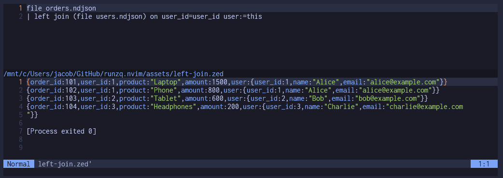

# RunZq Neovim Plugin

This Neovim plugin allows users to easily run `zq` commands on `.zed` files directly from within the editor. It provides commands to execute `zq` queries in a terminal split or print out the `zq` command for copying purposes. The plugin is designed to be configurable and integrates smoothly with Neovim.

## Features

- Run `zq` queries on `.zed` files from within Neovim.
- Print out the `zq` command so it can be copied and executed manually.
- Configurable path to the `zq` binary.

## Installation

To install this plugin, use your preferred Neovim plugin manager. Here is an example using [packer.nvim](https://github.com/wbthomason/packer.nvim):

```lua
use {
  'hens0n/runzq.nvim',
  config = function()
    require('runzq').setup {
      zq_path = '/path/to/zq'  -- Optional: specify the path to the `zq` binary if it's not in your system's PATH.
    }
  end
}
```



## Usage

### Keymap Setup

To make it easier to run the `RunZq` command, you can set up a keymap for convenience. Here is an example of setting up the keymap to `<leader>zq`:

```lua
vim.api.nvim_set_keymap('n', '<leader>zq', ':RunZq<CR>', { noremap = true, silent = true })
```

Add this keymap to your Neovim configuration file to quickly run the `RunZq` command with `<leader>zq`.

The plugin provides two commands:

1. `:RunZq` - Runs the `zq` command on the current `.zed` file in a terminal split.
2. `:PrintZqCommand` - Prints the constructed `zq` command for the current `.zed` file so you can copy and run it manually.

### Requirements

- Neovim 0.5+
- `zq` binary installed on your system.

### Example

Open a `.zed` file in Neovim, then run the following command to execute the `zq` query:

```vim
:RunZq
```

If you just want to see the command that will be executed, use:

```vim
:PrintZqCommand
```

## Configuration

You can configure the plugin using the `setup` function. This allows you to specify the path to the `zq` binary if it is not available in your system's PATH:

```lua
require('runzq').setup {
  zq_path = '/custom/path/to/zq'  -- Optional
}
```

## License

This plugin is available under the MIT License.

